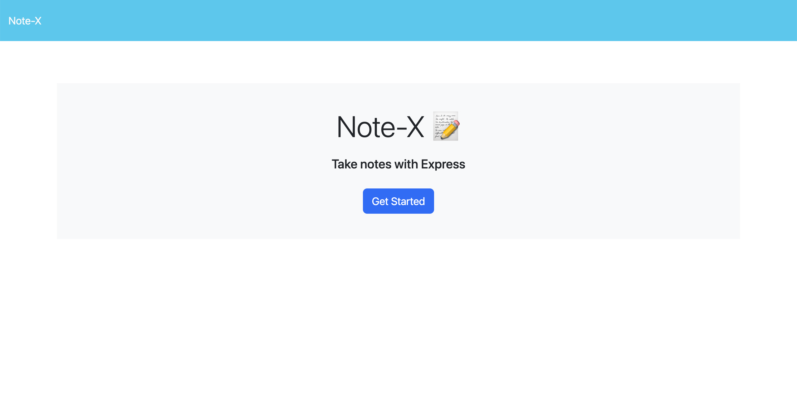
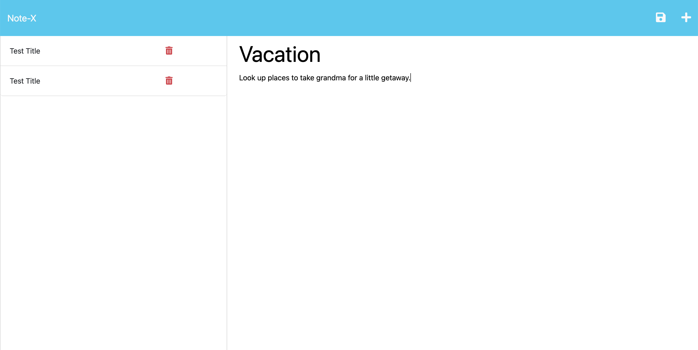
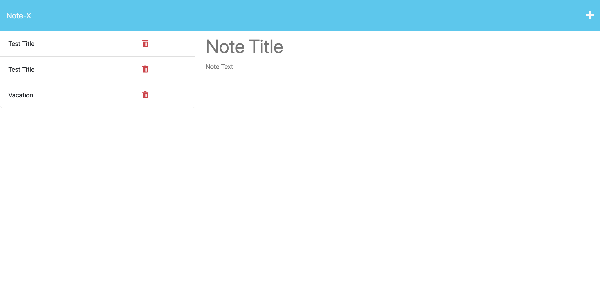

# NOTE-X
# 

  

  ## Table of Contents
  * [Description](#description)
  * [Installation](#installation)
  * [Usage](#usage)
  * [Licenses](#license)
  * [Credits](#credits)
  * [Test](#test)
  * [Questions](#questions)
  
  ## Description
  Note-X is a note taker application that can be used to write and save notes.  The application uses an Express.js back end and will save and retrieve notes from a JSON file. 

  ## Installation
  There is no installation required if you visit the live website (using the link posted below) hosted on Heroku. You can however, clone the repo of this app and run app on a localserver.  

  ## Usage
  Link to live site:  
  https://stark-coast-77236-96d7fc435184.herokuapp.com/

  Video of app functionality:
  https://drive.google.com/file/d/1B_N8YnwQ9rMMRTfJIaO5nk6cArkEfYLN/view

  Screenshots
  

  ## License
  This project is covered under the following license: MIT
  https://lbesson.mit-license.org/

  ## Credits
  Online Tutorials and Resources:

-  How to Fix SyntaxError: Unexpected token < in JSON at position 0 : https://support.stripe.com/questions/how-to-fix-syntaxerror-unexpected-token-in-json-at-position-0
-  Using npm packages in your projects: https://docs.npmjs.com/using-npm-packages-in-your-projects
-  Short Unique ID's UUID: https://www.npmjs.com/package/short-unique-id
-  UNIQID:  https://www.npmjs.com/package/uniqid
-  Parsing JSON with Node.js:  https://flaviocopes.com/nodejs-parse-json/

University of California Irvine Full Stack Development Bootcamp 2023 Resources:

-  UCI Bootcamp Slack Study Group:  https://ucivirtfsfpt0-bgx3057.slack.com/archives/C056LT7DUUF
-  UCI Bootcamp Module 11 Express.JS: activities 7, 8, 21, 22, 25, 26 
  

  ## Test
  Simply visit the website with the provided URL and write, save and delete notes to test the app.  

  ## Questions
  ### For questions regarding this project please feel free to take a look 
  at my GitHub profile [sharareh18](https://github.com/sharareh18) 

